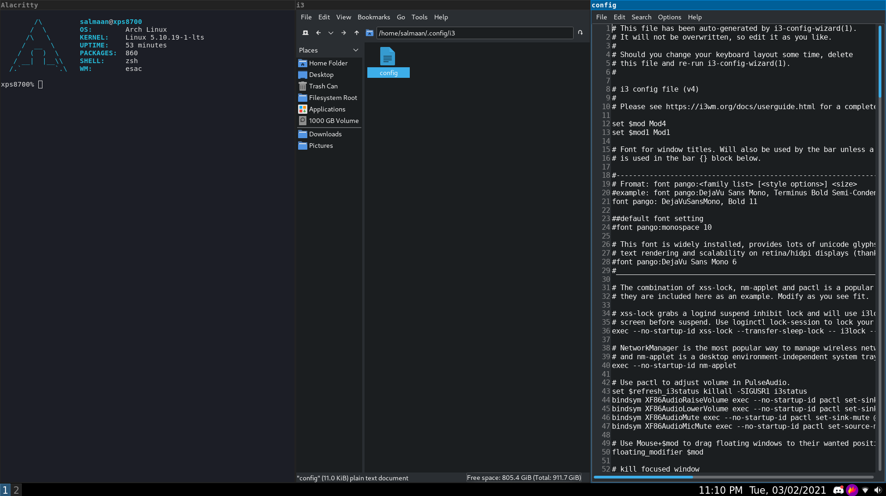

# About
I added programs that are not included in the distribution. It will be required to install majority of the programs to fully utilize my config out of the box. You can use it as a base to customize it yourself to get familiar with i3. I added the program I use that are not required for system to be usable. 

## Screenshot


## i3 config Location:
~/.config/i3/config

## i3 status config Location:
~/.config/i3status/config

### Remember to copy default i3status configuration to ~/.config/i3status
```
cp /etc/i3status.conf ~/.config/i3status/config
```

## Programs:
1. alacritty/lxterminal 
2. dmenu
3. rofi
4. leafpad 
6. pcmanfm
7. gvfs
8. chromium/firefox
9. flameshot
10. redshift
11. feh/nitrogen (Recommendation: Use nitrogen if new to the i3 window manager)
12. network-manager-applet 
13. udiskie (usb automounting utility)
14. polkit-gnome 
16. pavucontrol
17. pulseaudio
18. unclutter
19. zenity
20. discord

## Credit to the creators of the i3 window manager
Official Website: https://i3wm.org

Github Repository: https://github.com/i3/i3
